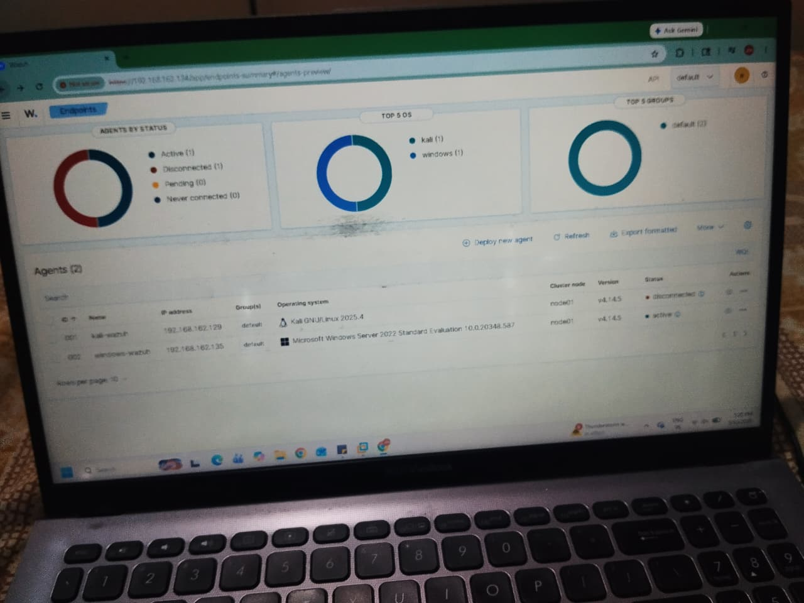
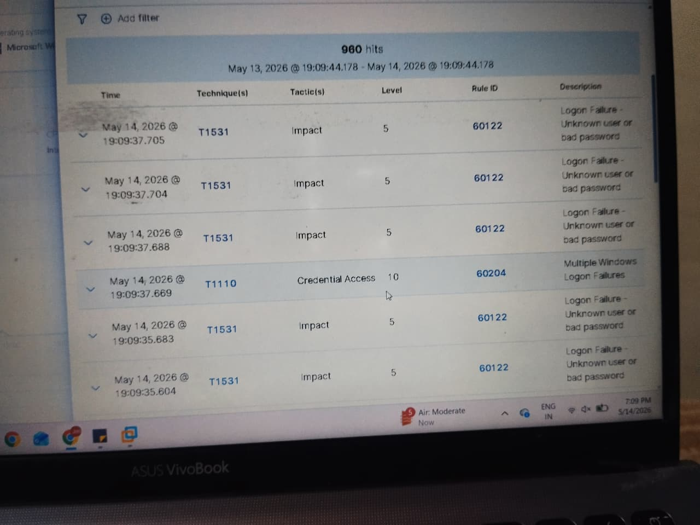
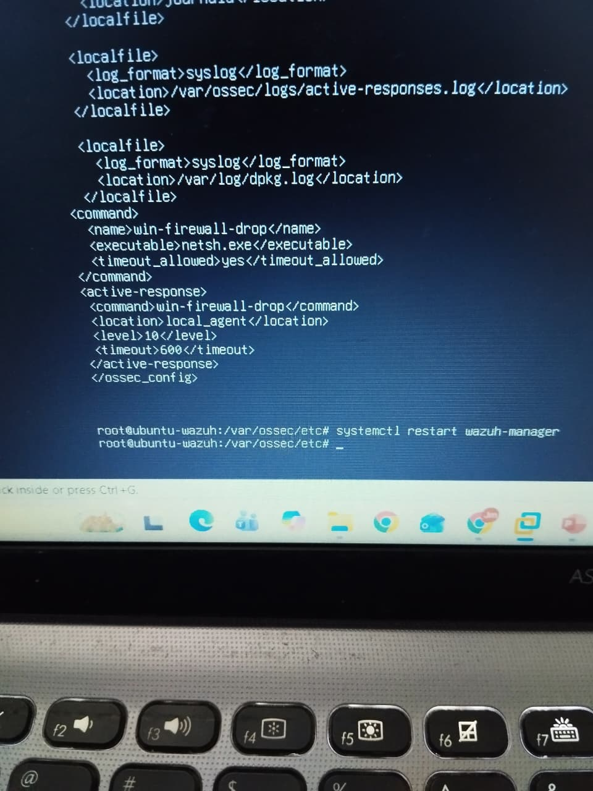
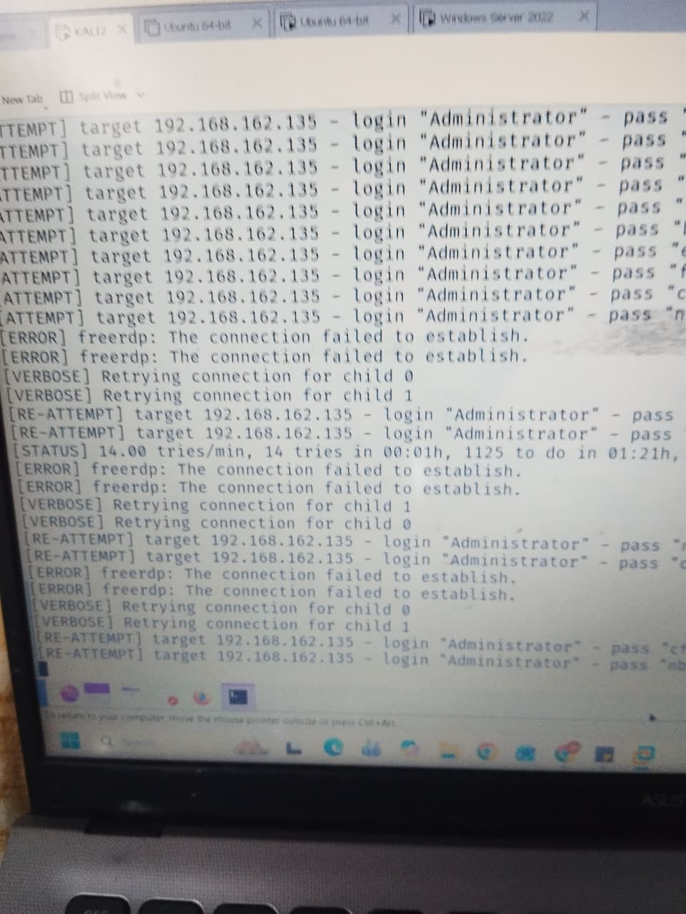
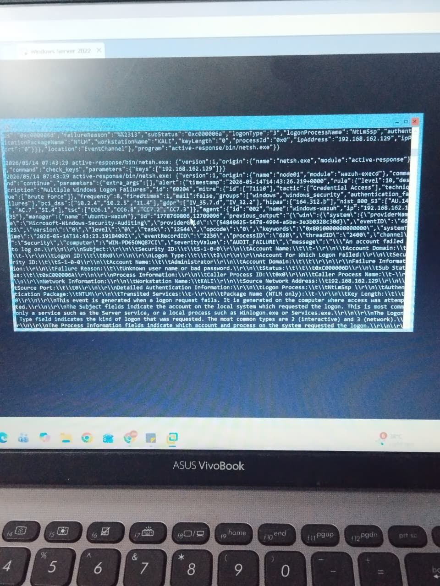

# Wazuh-SIEM-RDP-BruteForce-Lab
A home lab project demonstrating RDP brute-force detection and prevention using Wazuh SIEM.

## Objective
The goal of this project was to set up a Wazuh SIEM environment to monitor, detect, and automatically block an RDP Brute-Force attack against a Windows Server.

## Tools & Environment Used
* **SIEM:** Wazuh (Manager installed on Ubuntu)
* **Target:** Windows Server (with Wazuh Agent installed)
* **Attacker Machine:** Linux 
* **Attack Tool:** Hydra

## Project Architecture

## Step-by-Step Execution

### 1. The Attack
Simulated a brute-force attack on the Windows Server's open RDP port (3389) using Hydra. 
`hydra -l Administrator -P pass.txt rdp://192.168.162.135 -vV `

### 2. Detection (Blue Team Activity)
Successfully detected the brute-force attempts on the Wazuh Dashboard. The Windows Agent forwarded Event ID 4625 (Failed Logon) logs, which triggered Wazuh's Rule ID 60204 (Multiple Windows Logon Failures), confirming the attack in real-time.

### 3. Remediation & Prevention
Implemented security rules to block the attacker's IP address upon consecutive failed attempts, securing the RDP service from further compromise.

### 4. Attack Verification & Active Response Execution

**Attacker Perspective (Hydra):**
The attack was initiated targeting the `Administrator` account on the Windows Server. As seen in the terminal output, after reaching a specific threshold of failed attempts, Hydra throws `[ERROR] freerdp: The connection failed to establish`. This confirms the exact moment the target forcibly dropped the connection.

**Defender Perspective (Wazuh Active Response Logs):**
A deep dive into the raw JSON logs validates the automated SOAR capabilities of Wazuh. The logs capture the Attacker IP (`192.168.162.129`), the targeted account (`Administrator`), and the exact remediation command executed by the Wazuh agent: `active-response/bin/netsh.exe`. This proves that upon triggering Rule ID 60204, Wazuh automatically instructed the Windows Firewall to isolate and block the threat without human intervention.

## Conclusion
This lab demonstrates practical knowledge of log ingestion, threat detection, and incident response using an enterprise-grade SIEM. For full details, check the attached PDF document in this repository.

### 📄 Detailed Project Documentation
For a complete step-by-step breakdown, architecture details, and full configuration settings, please refer to the project report:
[Download/View the Full Project PDF Here](WAZUH-PROJECT-DOCUMENTATION-STRUCTURE.pdf)
